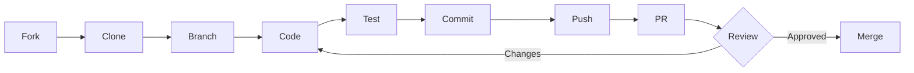

# 🤝 Guide de Contribution - AWKWARD LEGACY

## Table des matières

1. [Bienvenue](#bienvenue)
2. [Code de Conduite](#code-de-conduite)
3. [Comment Contribuer](#comment-contribuer)
4. [Environnement de Développement](#environnement-de-développement)
5. [Standards de Code](#standards-de-code)
6. [Process de Contribution](#process-de-contribution)
7. [Tests](#tests)
8. [Documentation](#documentation)
9. [Revue de Code](#revue-de-code)
10. [Releases](#releases)

---

## Bienvenue

Merci de votre intérêt pour contribuer à **AWKWARD LEGACY**! Ce projet vise à moderniser l'outil de généalogie GeneWeb en créant une interface Python moderne tout en préservant le cœur OCaml performant.

Nous accueillons les contributions de tous niveaux d'expérience et nous nous engageons à fournir un environnement accueillant et inclusif.

### 🎯 Types de Contributions Recherchées

- 🐛 **Bug fixes** : Corrections de bugs et problèmes
- ✨ **Nouvelles fonctionnalités** : Ajout de fonctionnalités utiles
- 📝 **Documentation** : Amélioration et traduction de la documentation
- 🧪 **Tests** : Ajout de tests unitaires, d'intégration ou de performance
- 🎨 **UI/UX** : Amélioration de l'interface utilisateur
- 🌍 **Traductions** : Support de nouvelles langues
- ♿ **Accessibilité** : Amélioration de l'accessibilité
- 🔒 **Sécurité** : Identification et correction de failles

---

## Code de Conduite

### 🌟 Nos Valeurs

- **Respect** : Traiter chacun avec respect et dignité
- **Inclusion** : Accueillir les contributeurs de tous horizons
- **Collaboration** : Travailler ensemble vers des objectifs communs
- **Excellence** : Viser la qualité dans tout ce que nous faisons
- **Apprentissage** : Encourager l'apprentissage continu

### ⛔ Comportements Inacceptables

- Harcèlement ou discrimination sous toute forme
- Commentaires offensants ou trolling
- Publication d'informations privées sans consentement
- Conduite non professionnelle ou inappropriée

### 📢 Signalement

Si vous observez un comportement inapproprié, contactez : conduct@awkward-legacy.com

---

## Comment Contribuer

### 🔍 Avant de Commencer

1. **Vérifiez les issues existantes**
   - Recherchez si votre problème/idée existe déjà
   - Commentez sur les issues existantes pour éviter le travail dupliqué

2. **Discutez des changements majeurs**
   - Ouvrez une issue pour discuter avant de commencer
   - Attendez le feedback de la communauté

3. **Lisez la documentation**
   - [README.md](README.md) - Vue d'ensemble du projet
   - [ARCHITECTURE.md](LegacyProject/docs/ARCHITECTURE.md) - Architecture technique
   - [API_DOCUMENTATION.md](LegacyProject/docs/API_DOCUMENTATION.md) - Documentation API

### 🚀 Quick Start

```bash
# 1. Fork le repository sur GitHub

# 2. Clone votre fork
git clone https://github.com/YOUR_USERNAME/awkward-legacy.git
cd awkward-legacy

# 3. Ajoutez le repo original comme remote
git remote add upstream https://github.com/awkward-legacy/awkward-legacy.git

# 4. Créez une branche pour votre feature
git checkout -b feature/ma-super-feature

# 5. Installez les dépendances
pip install -r requirements.txt
pip install -r requirements-dev.txt

# 6. Installez les pre-commit hooks
pre-commit install
pre-commit install --hook-type commit-msg

# 7. Faites vos modifications et committez
git add .
git commit -m "feat: ajout de ma super feature"

# 8. Push vers votre fork
git push origin feature/ma-super-feature

# 9. Ouvrez une Pull Request
```

---

## Environnement de Développement

### 📋 Prérequis

- **Python** : 3.9 ou supérieur
- **OCaml** : 4.14 (pour le core GeneWeb)
- **PostgreSQL** : 14+
- **Redis** : 7+
- **Docker** : 20.10+ (optionnel mais recommandé)
- **Git** : 2.30+

### 🛠️ Installation Locale

#### Méthode 1 : Installation Complète

```bash
# Cloner le repository
git clone https://github.com/awkward-legacy/awkward-legacy.git
cd awkward-legacy

# Créer un environnement virtuel Python
python3 -m venv venv
source venv/bin/activate  # Linux/Mac
# ou
venv\Scripts\activate  # Windows

# Installer les dépendances Python
pip install -r requirements.txt
pip install -r requirements-dev.txt

# Installer OCaml et OPAM
# Mac
brew install opam

# Linux
apt-get install opam  # Debian/Ubuntu
dnf install opam      # Fedora

# Initialiser OPAM
opam init
eval $(opam env)

# Installer les dépendances OCaml
cd geneweb
opam install . --deps-only
dune build

# Configurer la base de données
createdb awkward_legacy
psql awkward_legacy < schema.sql

# Configurer Redis
redis-server &

# Configurer les variables d'environnement
cp .env.example .env
# Éditez .env avec vos valeurs

# Lancer les migrations
python manage.py migrate

# Lancer le serveur de développement
python manage.py runserver
```

#### Méthode 2 : Docker (Recommandée)

```bash
# Cloner le repository
git clone https://github.com/awkward-legacy/awkward-legacy.git
cd awkward-legacy

# Copier le fichier d'environnement
cp .env.example .env
# Éditez .env avec vos valeurs

# Lancer avec Docker Compose
docker-compose up -d

# Vérifier que tout fonctionne
docker-compose ps
docker-compose logs

# Accéder à l'application
# http://localhost:8000
```

### 🔧 Configuration IDE

#### VS Code (Recommandé)

```json
// .vscode/settings.json
{
  "python.linting.enabled": true,
  "python.linting.pylintEnabled": true,
  "python.linting.flake8Enabled": true,
  "python.formatting.provider": "black",
  "python.formatting.blackArgs": ["--line-length=120"],
  "editor.formatOnSave": true,
  "editor.codeActionsOnSave": {
    "source.organizeImports": true
  },
  "[python]": {
    "editor.rulers": [120]
  }
}
```

Extensions recommandées :
- Python
- Pylance
- OCaml Platform
- Docker
- GitLens
- EditorConfig

#### PyCharm

1. File → Settings → Project → Project Interpreter
2. Configurez l'interpréteur Python (venv)
3. Activez les inspections Pylint et Flake8
4. Configurez Black comme formatteur

---

## Standards de Code

### 🐍 Python

#### Style Guide

Nous suivons [PEP 8](https://pep8.org/) avec ces modifications :
- Longueur de ligne : 120 caractères max
- Imports : Triés avec `isort`
- Formatage : Automatique avec `black`

#### Conventions de Nommage

```python
# Classes : PascalCase
class UserManager:
    pass

# Fonctions et variables : snake_case
def calculate_age(birth_date):
    user_age = 0
    return user_age

# Constantes : UPPER_SNAKE_CASE
MAX_CONNECTIONS = 100
DEFAULT_TIMEOUT = 30

# Variables privées : préfixe underscore
_internal_cache = {}

# Variables "vraiment" privées : double underscore
class MyClass:
    def __init__(self):
        self.__private_var = 42
```

#### Docstrings (Google Style)

```python
def complex_function(param1: str, param2: int = 5) -> dict:
    """
    Effectue une opération complexe.

    Cette fonction fait quelque chose de très important et complexe
    qui nécessite une documentation détaillée.

    Args:
        param1: Description du premier paramètre
        param2: Description du second paramètre (défaut: 5)

    Returns:
        Un dictionnaire contenant:
            - 'result': Le résultat du calcul
            - 'status': Le statut de l'opération

    Raises:
        ValueError: Si param1 est vide
        TypeError: Si param2 n'est pas un entier

    Example:
        >>> result = complex_function("test", 10)
        >>> print(result['status'])
        'success'
    """
    if not param1:
        raise ValueError("param1 ne peut pas être vide")

    return {
        'result': f"{param1}_{param2}",
        'status': 'success'
    }
```

#### Type Hints

```python
from typing import List, Dict, Optional, Union, Tuple, Callable
from datetime import datetime

def process_data(
    items: List[Dict[str, Union[str, int]]],
    callback: Optional[Callable[[str], None]] = None,
    timeout: int = 30
) -> Tuple[bool, str]:
    """Process une liste d'items avec un callback optionnel."""
    pass
```

### 🐪 OCaml

```ocaml
(* Conventions pour le code OCaml *)

(* Types : snake_case *)
type person_record = {
  first_name : string;
  last_name : string;
  birth_date : date option;
}

(* Modules : PascalCase *)
module PersonManager = struct
  (* Fonctions : snake_case *)
  let find_person id = ...

  (* Constantes : UPPER_CASE *)
  let MAX_RESULTS = 1000
end

(* Commentaires de documentation *)
(** [find_ancestors person depth] trouve tous les ancêtres de [person]
    jusqu'à [depth] générations. Retourne une liste de [person_record]. *)
val find_ancestors : person_record -> int -> person_record list
```

### 📝 Commits

Nous utilisons [Conventional Commits](https://www.conventionalcommits.org/):

```bash
# Format
<type>(<scope>): <subject>

# Types
feat:     Nouvelle fonctionnalité
fix:      Correction de bug
docs:     Documentation uniquement
style:    Formatage, point-virgules manquants, etc
refactor: Refactoring du code
perf:     Amélioration des performances
test:     Ajout de tests
chore:    Maintenance, dépendances, etc
ci:       Configuration CI/CD

# Exemples
feat(auth): ajout de l'authentification 2FA
fix(api): correction de la fuite mémoire dans /search
docs(readme): mise à jour des instructions d'installation
style: application de black sur tous les fichiers
refactor(db): simplification des requêtes SQL
perf(search): optimisation de l'algorithme de recherche
test(user): ajout de tests pour UserManager
chore(deps): mise à jour de Django vers 4.2
ci: ajout du workflow GitHub Actions
```

### 📏 Limites de Complexité

- **Complexité Cyclomatique** : Max 15 par fonction
- **Complexité Cognitive** : Max 20 par fonction
- **Longueur de Fonction** : Max 100 lignes
- **Longueur de Fichier** : Max 2000 lignes
- **Nombre d'Arguments** : Max 10 par fonction
- **Profondeur d'Imbrication** : Max 5 niveaux

---

## Process de Contribution

### 📊 Workflow Git



### 🌿 Branches

- `main` : Branche stable de production
- `develop` : Branche de développement
- `feature/*` : Nouvelles fonctionnalités
- `bugfix/*` : Corrections de bugs
- `hotfix/*` : Corrections urgentes en production
- `release/*` : Préparation des releases

### 📋 Pull Request Process

1. **Préparez votre PR**
   ```bash
   # Synchronisez avec upstream
   git fetch upstream
   git rebase upstream/develop

   # Résolvez les conflits si nécessaire

   # Vérifiez que tout passe
   pre-commit run --all-files
   pytest
   ```

2. **Créez la PR**
   - Titre descriptif suivant Conventional Commits
   - Description détaillée du changement
   - Référence aux issues liées (#123)
   - Screenshots si changements UI
   - Checklist complétée

3. **Template de PR**
   ```markdown
   ## Description
   Brève description du changement et de sa motivation.

   ## Type de changement
   - [ ] Bug fix (changement non-breaking qui corrige un problème)
   - [ ] Nouvelle feature (changement non-breaking qui ajoute une fonctionnalité)
   - [ ] Breaking change (fix ou feature qui casserait la compatibilité)
   - [ ] Documentation

   ## Comment tester
   1. Étape 1
   2. Étape 2
   3. Vérifier que...

   ## Checklist
   - [ ] Mon code suit les standards du projet
   - [ ] J'ai fait une auto-review de mon code
   - [ ] J'ai commenté mon code, particulièrement les parties complexes
   - [ ] J'ai mis à jour la documentation
   - [ ] Mes changements ne génèrent pas de warnings
   - [ ] J'ai ajouté des tests
   - [ ] Les tests unitaires passent localement
   - [ ] Les tests d'intégration passent
   - [ ] J'ai vérifié la compatibilité avec Python 3.9+

   ## Issues liées
   Closes #123
   Fixes #456
   ```

### ⏱️ Temps de Réponse

- **Première réponse** : < 48 heures
- **Review initiale** : < 1 semaine
- **Merge (si approuvé)** : < 2 semaines

---

## Tests

### 🧪 Types de Tests

#### Tests Unitaires
```python
# test_user.py
import pytest
from lib.user import User

class TestUser:
    def test_create_user(self):
        """Test la création d'un utilisateur."""
        user = User(name="John", email="john@example.com")
        assert user.name == "John"
        assert user.email == "john@example.com"

    def test_invalid_email(self):
        """Test qu'un email invalide lève une exception."""
        with pytest.raises(ValueError):
            User(name="John", email="invalid")
```

#### Tests d'Intégration
```python
# test_integration.py
import pytest
from django.test import TestCase
from rest_framework.test import APIClient

class TestUserAPI(TestCase):
    def setUp(self):
        self.client = APIClient()

    def test_user_registration_flow(self):
        """Test le flow complet d'inscription."""
        # 1. Register
        response = self.client.post('/api/register/', {
            'username': 'testuser',
            'email': 'test@example.com',
            'password': 'SecurePass123!'
        })
        assert response.status_code == 201

        # 2. Login
        response = self.client.post('/api/login/', {
            'username': 'testuser',
            'password': 'SecurePass123!'
        })
        assert response.status_code == 200
        token = response.data['token']

        # 3. Access protected resource
        self.client.credentials(HTTP_AUTHORIZATION=f'Bearer {token}')
        response = self.client.get('/api/profile/')
        assert response.status_code == 200
```

### 🎯 Coverage Minimum

- **Global** : 80%
- **Nouveaux fichiers** : 90%
- **Code critique** : 95%

### 🚀 Lancer les Tests

```bash
# Tests unitaires
pytest tests/unit/

# Tests d'intégration
pytest tests/integration/

# Tests de performance
pytest tests/performance/ --benchmark

# Tous les tests avec coverage
pytest --cov=modernProject --cov-report=html

# Tests spécifiques
pytest tests/unit/test_user.py::TestUser::test_create_user

# Tests en parallèle
pytest -n auto

# Tests avec verbosité
pytest -vv

# Tests avec markers
pytest -m "not slow"
```

---

## Documentation

### 📚 Types de Documentation

1. **Code Documentation**
   - Docstrings pour toutes les fonctions publiques
   - Commentaires pour la logique complexe
   - Type hints partout

2. **API Documentation**
   - OpenAPI/Swagger specs
   - Exemples de requêtes/réponses
   - Codes d'erreur documentés

3. **User Documentation**
   - Guides d'utilisation
   - Tutoriels
   - FAQ

4. **Developer Documentation**
   - Architecture
   - Guides de contribution
   - Décisions techniques (ADR)

### ✍️ Style de Documentation

- **Clair et concis** : Évitez le jargon inutile
- **Exemples** : Incluez des exemples pratiques
- **À jour** : Mettez à jour avec le code
- **Multilingue** : Français et Anglais minimum

### 🌍 Traductions

Les traductions sont gérées via des fichiers PO/POT :

```bash
# Extraire les strings
python manage.py makemessages -l fr
python manage.py makemessages -l en

# Compiler les traductions
python manage.py compilemessages
```

---

## Revue de Code

### 👀 Checklist de Review

#### Architecture & Design
- [ ] Le design est-il approprié pour le problème?
- [ ] Le code est-il dans le bon module/package?
- [ ] Y a-t-il de la duplication qu'on pourrait factoriser?
- [ ] Le code suit-il les patterns du projet?

#### Fonctionnalité
- [ ] Le code fait-il ce qu'il est censé faire?
- [ ] Les edge cases sont-ils gérés?
- [ ] Les erreurs sont-elles gérées correctement?
- [ ] Y a-t-il des race conditions potentielles?

#### Performance
- [ ] Y a-t-il des optimisations évidentes manquées?
- [ ] Les requêtes DB sont-elles optimisées (N+1)?
- [ ] Le caching est-il utilisé appropriément?
- [ ] Y a-t-il des fuites mémoire potentielles?

#### Sécurité
- [ ] Les inputs sont-ils validés et sanitizés?
- [ ] Y a-t-il des injections possibles (SQL, XSS)?
- [ ] Les données sensibles sont-elles protégées?
- [ ] Les permissions sont-elles vérifiées?

#### Tests
- [ ] Les tests couvrent-ils les cas nominaux?
- [ ] Les tests couvrent-ils les edge cases?
- [ ] Les tests sont-ils maintenables?
- [ ] Les tests passent-ils en local?

#### Documentation
- [ ] Le code est-il auto-documenté?
- [ ] Les docstrings sont-elles complètes?
- [ ] La documentation utilisateur est-elle à jour?
- [ ] Les changements d'API sont-ils documentés?

### 💬 Donner du Feedback

#### ✅ Bon Feedback
```
"Cette fonction pourrait être simplifiée en utilisant une list comprehension :
```python
# Au lieu de
result = []
for item in items:
    if item.is_valid():
        result.append(item.value)

# Considérez
result = [item.value for item in items if item.is_valid()]
```
Cela rendrait le code plus pythonique et plus lisible."
```

#### ❌ Mauvais Feedback
```
"Ce code est nul, refais tout."
```

### 🎯 Principes de Review

1. **Soyez constructif** : Proposez des solutions
2. **Soyez spécifique** : Pointez les lignes exactes
3. **Soyez objectif** : Basez-vous sur les standards
4. **Soyez humble** : Utilisez "je pense", "peut-être"
5. **Soyez reconnaissant** : Remerciez pour le travail

---

## Releases

### 📦 Versioning

Nous suivons [Semantic Versioning](https://semver.org/):

```
MAJOR.MINOR.PATCH

1.2.3
│ │ └─ PATCH: Bug fixes, pas de changements d'API
│ └─── MINOR: Nouvelles features, rétro-compatible
└───── MAJOR: Breaking changes
```

### 🚀 Release Process

1. **Préparation**
   ```bash
   # Créer une branche release
   git checkout -b release/1.2.0

   # Mettre à jour la version
   bump2version minor  # ou major, patch

   # Mettre à jour CHANGELOG.md
   # Générer les release notes
   ```

2. **Testing**
   - Tests automatisés complets
   - Tests manuels des features critiques
   - Test de migration depuis version précédente

3. **Release**
   ```bash
   # Merger dans main
   git checkout main
   git merge --no-ff release/1.2.0

   # Tagger
   git tag -a v1.2.0 -m "Release version 1.2.0"

   # Push
   git push origin main --tags

   # Merger dans develop
   git checkout develop
   git merge --no-ff main
   ```

4. **Déploiement**
   - Build des images Docker
   - Push vers registry
   - Déploiement staging
   - Tests de smoke
   - Déploiement production

### 📝 Changelog

Format du CHANGELOG.md :

```markdown
# Changelog

## [Unreleased]

## [1.2.0] - 2025-10-20
### Added
- Nouvelle fonctionnalité X (#123)
- Support pour Y (#456)

### Changed
- Amélioration de la performance de Z (#789)

### Deprecated
- La méthode old_method() sera retirée en 2.0.0

### Removed
- Support de Python 3.8

### Fixed
- Correction du bug dans la recherche (#321)

### Security
- Mise à jour de dependency pour CVE-2025-1234
```

---

## 🆘 Obtenir de l'Aide

### 📬 Canaux de Communication

- **GitHub Issues** : Pour les bugs et feature requests
- **Discussions** : Pour les questions générales
- **Discord** : [discord.gg/awkward-legacy](https://discord.gg/awkward-legacy)
- **Email** : dev@awkward-legacy.com

### 📖 Ressources

#### Documentation Officielle
- [Documentation Utilisateur](https://docs.awkward-legacy.com)
- [Documentation API](https://api.awkward-legacy.com)
- [Blog Technique](https://blog.awkward-legacy.com)

#### Tutoriels
- [Getting Started](docs/tutorials/getting-started.md)
- [Building Your First Feature](docs/tutorials/first-feature.md)
- [Testing Guide](docs/tutorials/testing.md)

#### Exemples
- [Code Examples](examples/)
- [Plugin Template](templates/plugin/)

### 🎓 Formation

Pour les nouveaux contributeurs :
1. Lisez le [README](README.md)
2. Suivez le [tutoriel de démarrage](docs/tutorials/getting-started.md)
3. Regardez les [good first issues](https://github.com/awkward-legacy/awkward-legacy/labels/good%20first%20issue)
4. Demandez un mentor sur Discord

---

## 🏆 Reconnaissance

### 🌟 Hall of Fame

Nous reconnaissons nos contributeurs dans :
- [CONTRIBUTORS.md](CONTRIBUTORS.md)
- README.md (top contributeurs)
- Release notes
- Site web du projet

### 🎁 Swag & Récompenses

Les contributeurs réguliers peuvent recevoir :
- T-shirts AWKWARD LEGACY
- Stickers
- Accès early-access aux nouvelles features
- Invitation aux meetups

---

## 📜 License

En contribuant à AWKWARD LEGACY, vous acceptez que vos contributions soient sous la même [license MIT](LICENSE) que le projet.

---

## 🤔 FAQ

### Q: Je suis débutant, puis-je contribuer?
**R:** Absolument! Cherchez les issues tagguées `good first issue` ou `beginner friendly`. N'hésitez pas à demander de l'aide.

### Q: Combien de temps pour qu'ma PR soit reviewée?
**R:** Nous visons une première réponse sous 48h et une review complète sous 1 semaine.

### Q: Puis-je proposer une grosse feature?
**R:** Oui, mais discutez-en d'abord dans une issue pour s'assurer qu'elle correspond à la vision du projet.

### Q: Comment devenir maintainer?
**R:** Les maintainers sont choisis parmi les contributeurs réguliers qui démontrent :
- Compréhension profonde du code
- Reviews de qualité
- Contributions régulières
- Alignement avec les valeurs du projet

### Q: Mon anglais n'est pas parfait, est-ce un problème?
**R:** Pas du tout! Nous acceptons les contributions en français et en anglais. L'important est que le code soit de qualité.

---

## 📊 Métriques de Contribution

Nous suivons ces métriques pour améliorer le process :
- **Temps moyen de première réponse** : < 48h
- **Temps moyen de review** : < 1 semaine
- **Taux d'acceptation des PR** : > 70%
- **Satisfaction des contributeurs** : > 4.5/5

---

## ✨ Merci!

Merci de prendre le temps de contribuer à AWKWARD LEGACY. Chaque contribution, grande ou petite, est appréciée et nous aide à construire un meilleur outil pour la communauté généalogique.

**Happy Coding!** 🚀

---

**Dernière mise à jour:** 17 Octobre 2025
**Version:** 1.0.0
**Maintainers:** [@awkward-team](https://github.com/awkward-team)