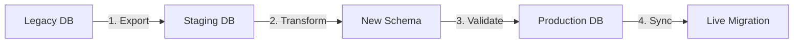

#  Plan de Déploiement Production - AWKWARD LEGACY

## Table des Matières

1. [Vue d'Ensemble](#vue-densemble)
2. [Prérequis](#prérequis)
3. [Architecture de Production](#architecture-de-production)
4. [Phase 1: Préparation](#phase-1-préparation)
5. [Phase 2: Infrastructure](#phase-2-infrastructure)
6. [Phase 3: Migration des Données](#phase-3-migration-des-données)
7. [Phase 4: Déploiement](#phase-4-déploiement)
8. [Phase 5: Validation](#phase-5-validation)
9. [Phase 6: Go-Live](#phase-6-go-live)
10. [Phase 7: Post-Déploiement](#phase-7-post-déploiement)
11. [Plan de Rollback](#plan-de-rollback)
12. [Maintenance et Support](#maintenance-et-support)

---

## Vue d'Ensemble

###  Objectifs du Déploiement

- **Date cible**: 1er Novembre 2025
- **Durée estimée**: 4 semaines
- **Downtime prévu**: 2 heures (migration finale)
- **Environnements**: Dev → Staging → Production

###  Critères de Succès

-  Zéro perte de données
-  Performance ≥ baseline (< 100ms P95)
-  Disponibilité > 99.9%
-  Conformité RGPD maintenue
-  Rollback possible < 15 minutes

###  Équipe de Déploiement

| Rôle | Responsable | Contact |
|------|-------------|---------|
| Chef de Projet | PM Lead | pm@awkward-legacy.com |
| Architecte Technique | Tech Lead | tech@awkward-legacy.com |
| DevOps Lead | DevOps Team | devops@awkward-legacy.com |
| DBA | Database Team | dba@awkward-legacy.com |
| Security Officer | Security Team | security@awkward-legacy.com |
| Support Lead | Support Team | support@awkward-legacy.com |

---

## Prérequis

###  Prérequis Techniques

#### Infrastructure Cloud (AWS)
- [ ] Compte AWS avec billing configuré
- [ ] VPC avec sous-réseaux publics/privés
- [ ] Security Groups configurés
- [ ] IAM roles et policies
- [ ] Route 53 pour DNS
- [ ] Certificate Manager (SSL/TLS)
- [ ] S3 buckets pour backups

#### Outils et Services
- [ ] Docker Registry (ECR)
- [ ] Kubernetes (EKS) ou Docker Swarm
- [ ] RDS PostgreSQL Multi-AZ
- [ ] ElastiCache Redis
- [ ] CloudWatch pour monitoring
- [ ] SNS/SQS pour notifications

###  Prérequis Documentation

- [ ] Architecture diagram validé
- [ ] Runbooks opérationnels
- [ ] Guide de troubleshooting
- [ ] Plan de communication
- [ ] Contacts d'urgence à jour

###  Checklist Pré-Déploiement

```markdown
## Security
- [ ] Scan de vulnérabilités passé
- [ ] Audit de sécurité complété
- [ ] Secrets dans Vault/KMS
- [ ] Certificats SSL valides

## Tests
- [ ] Tests unitaires: 100% pass
- [ ] Tests d'intégration: 100% pass
- [ ] Tests de charge: Objectifs atteints
- [ ] UAT signé par le client

## Backups
- [ ] Backup complet de production
- [ ] Test de restauration validé
- [ ] Snapshots des VMs
- [ ] Export des configurations
```

---

## Architecture de Production

###  Architecture Cible

```
┌─────────────────────────────────────────────────────────┐
│                     CloudFlare CDN                       │
└─────────────────────────┬───────────────────────────────┘
                          │
              ┌───────────▼───────────┐
              │   AWS Load Balancer   │
              │   (Application LB)    │
              └───────────┬───────────┘
                          │
        ┌─────────────────┴─────────────────┐
        │                                   │
┌───────▼────────┐              ┌──────────▼────────┐
│  ECS Cluster   │              │   ECS Cluster     │
│  Region: eu-w1 │              │  Region: eu-w2    │
│                │              │   (Standby)       │
├────────────────┤              ├──────────────────┤
│ • 3x App nodes │              │ • 3x App nodes   │
│ • Auto-scaling │              │ • Auto-scaling   │
└────────┬───────┘              └─────────┬────────┘
         │                                │
         └──────────────┬─────────────────┘
                        │
            ┌───────────▼────────────┐
            │   RDS PostgreSQL      │
            │   Multi-AZ Cluster    │
            ├───────────────────────┤
            │ • Primary: eu-west-1a │
            │ • Standby: eu-west-1b │
            │ • Read Replica: eu-w2 │
            └───────────────────────┘
```

###  Spécifications des Serveurs

#### Application Servers (ECS)
```yaml
Instance Type: t3.xlarge
vCPUs: 4
Memory: 16 GB
Storage: 100 GB SSD
Network: Enhanced networking
Auto-scaling:
  Min: 3
  Max: 10
  Target CPU: 60%
```

#### Database (RDS)
```yaml
Instance Class: db.r5.2xlarge
vCPUs: 8
Memory: 64 GB
Storage: 500 GB SSD (gp3)
IOPS: 16,000
Backup:
  Window: 03:00-04:00 UTC
  Retention: 30 days
```

#### Cache (ElastiCache)
```yaml
Node Type: cache.r6g.xlarge
vCPUs: 4
Memory: 13.07 GB
Network: 10 Gbps
Replication:
  Groups: 2
  Replicas: 2
```

---

## Phase 1: Préparation

###  Timeline: Semaine 1

#### Jour 1-2: Validation de l'Infrastructure

```bash
# 1. Vérifier les quotas AWS
aws service-quotas get-service-quota \
  --service-code ec2 \
  --quota-code L-1216C47A

# 2. Créer le VPC et les subnets
aws cloudformation create-stack \
  --stack-name awkward-legacy-vpc \
  --template-body file://infrastructure/vpc.yaml

# 3. Configurer les Security Groups
aws ec2 create-security-group \
  --group-name awkward-web-sg \
  --description "Security group for web servers"

# 4. Setup des IAM roles
aws iam create-role \
  --role-name awkward-ecs-task-role \
  --assume-role-policy-document file://iam/trust-policy.json
```

#### Jour 3-4: Préparation des Images Docker

```bash
# Build des images
docker build -t awkward-legacy:v1.0.0 .

# Tag pour ECR
docker tag awkward-legacy:v1.0.0 \
  123456789.dkr.ecr.eu-west-1.amazonaws.com/awkward-legacy:v1.0.0

# Push vers ECR
aws ecr get-login-password --region eu-west-1 | \
  docker login --username AWS --password-stdin \
  123456789.dkr.ecr.eu-west-1.amazonaws.com

docker push 123456789.dkr.ecr.eu-west-1.amazonaws.com/awkward-legacy:v1.0.0
```

#### Jour 5: Configuration du Monitoring

```yaml
# cloudwatch-dashboard.yaml
Resources:
  Dashboard:
    Type: AWS::CloudWatch::Dashboard
    Properties:
      DashboardName: awkward-legacy-prod
      DashboardBody: !Sub |
        {
          "widgets": [
            {
              "type": "metric",
              "properties": {
                "metrics": [
                  ["AWS/ECS", "CPUUtilization"],
                  [".", "MemoryUtilization"]
                ],
                "period": 300,
                "stat": "Average",
                "region": "${AWS::Region}"
              }
            }
          ]
        }
```

---

## Phase 2: Infrastructure

###  Timeline: Semaine 2

#### Configuration Terraform

```hcl
# main.tf
terraform {
  required_version = ">= 1.0"

  backend "s3" {
    bucket = "awkward-legacy-terraform-state"
    key    = "production/terraform.tfstate"
    region = "eu-west-1"
  }
}

# ECS Cluster
resource "aws_ecs_cluster" "main" {
  name = "awkward-legacy-prod"

  setting {
    name  = "containerInsights"
    value = "enabled"
  }
}

# Application Load Balancer
resource "aws_lb" "main" {
  name               = "awkward-legacy-alb"
  internal           = false
  load_balancer_type = "application"
  security_groups    = [aws_security_group.alb.id]
  subnets           = aws_subnet.public[*].id

  enable_deletion_protection = true
  enable_http2              = true
}

# RDS Instance
resource "aws_db_instance" "postgres" {
  identifier     = "awkward-legacy-db"
  engine         = "postgres"
  engine_version = "14.7"
  instance_class = "db.r5.2xlarge"

  allocated_storage     = 500
  storage_type         = "gp3"
  storage_encrypted    = true

  db_name  = "awkward_legacy"
  username = var.db_username
  password = var.db_password

  vpc_security_group_ids = [aws_security_group.rds.id]
  db_subnet_group_name   = aws_db_subnet_group.main.name

  backup_retention_period = 30
  backup_window          = "03:00-04:00"
  maintenance_window     = "sun:04:00-sun:05:00"

  multi_az               = true
  publicly_accessible    = false

  enabled_cloudwatch_logs_exports = ["postgresql"]

  tags = {
    Name        = "awkward-legacy-db"
    Environment = "production"
  }
}
```

#### Déploiement de l'Infrastructure

```bash
# Initialize Terraform
terraform init

# Plan deployment
terraform plan -out=tfplan

# Apply changes
terraform apply tfplan

# Verify resources
aws ecs describe-clusters --clusters awkward-legacy-prod
aws rds describe-db-instances --db-instance-identifier awkward-legacy-db
```

---

## Phase 3: Migration des Données

###  Timeline: Semaine 2-3

#### Stratégie de Migration



#### Script de Migration

```python
#!/usr/bin/env python3
"""
Migration script for AWKWARD LEGACY database
"""

import psycopg2
from psycopg2 import sql
import logging
from datetime import datetime

class DatabaseMigration:
    def __init__(self, source_config, target_config):
        self.source = psycopg2.connect(**source_config)
        self.target = psycopg2.connect(**target_config)
        self.logger = logging.getLogger(__name__)

    def migrate_schema(self):
        """Migrate database schema"""
        self.logger.info("Starting schema migration...")

        with open('schema/production.sql', 'r') as f:
            schema_sql = f.read()

        with self.target.cursor() as cursor:
            cursor.execute(schema_sql)
            self.target.commit()

        self.logger.info("Schema migration completed")

    def migrate_data(self, batch_size=1000):
        """Migrate data with batching"""
        tables = ['users', 'persons', 'families', 'relationships']

        for table in tables:
            self.logger.info(f"Migrating table: {table}")
            self._migrate_table(table, batch_size)

    def _migrate_table(self, table, batch_size):
        """Migrate single table"""
        with self.source.cursor() as src_cursor:
            with self.target.cursor() as tgt_cursor:
                # Get total count
                src_cursor.execute(f"SELECT COUNT(*) FROM {table}")
                total = src_cursor.fetchone()[0]

                # Batch migration
                offset = 0
                while offset < total:
                    src_cursor.execute(
                        f"SELECT * FROM {table} LIMIT %s OFFSET %s",
                        (batch_size, offset)
                    )

                    rows = src_cursor.fetchall()
                    if not rows:
                        break

                    # Insert batch
                    self._insert_batch(tgt_cursor, table, rows)
                    offset += batch_size

                    # Progress
                    progress = min(100, (offset / total) * 100)
                    self.logger.info(f"  {table}: {progress:.1f}% complete")

                self.target.commit()

    def validate_migration(self):
        """Validate data integrity"""
        self.logger.info("Validating migration...")

        validations = [
            self._validate_counts,
            self._validate_checksums,
            self._validate_relationships
        ]

        for validation in validations:
            if not validation():
                raise Exception(f"Validation failed: {validation.__name__}")

        self.logger.info("All validations passed")

    def _validate_counts(self):
        """Validate row counts"""
        tables = ['users', 'persons', 'families']

        for table in tables:
            with self.source.cursor() as src_cur:
                src_cur.execute(f"SELECT COUNT(*) FROM {table}")
                src_count = src_cur.fetchone()[0]

            with self.target.cursor() as tgt_cur:
                tgt_cur.execute(f"SELECT COUNT(*) FROM {table}")
                tgt_count = tgt_cur.fetchone()[0]

            if src_count != tgt_count:
                self.logger.error(
                    f"Count mismatch for {table}: "
                    f"source={src_count}, target={tgt_count}"
                )
                return False

        return True

if __name__ == "__main__":
    migration = DatabaseMigration(
        source_config={
            'host': 'legacy-db.example.com',
            'database': 'geneweb',
            'user': 'migration_user'
        },
        target_config={
            'host': 'awkward-legacy-db.amazonaws.com',
            'database': 'awkward_legacy',
            'user': 'migration_user'
        }
    )

    migration.migrate_schema()
    migration.migrate_data()
    migration.validate_migration()
```

---

## Phase 4: Déploiement

###  Timeline: Semaine 3

#### Déploiement Blue-Green

```bash
#!/bin/bash
# blue-green-deploy.sh

set -e

ENVIRONMENT="production"
VERSION="v1.0.0"
BLUE_ENV="awkward-blue"
GREEN_ENV="awkward-green"

echo " Starting Blue-Green Deployment"

# Step 1: Deploy to Green environment
echo " Deploying version $VERSION to GREEN environment..."

aws ecs update-service \
  --cluster $GREEN_ENV \
  --service awkward-app \
  --task-definition awkward-legacy:$VERSION \
  --desired-count 3

# Wait for deployment
aws ecs wait services-stable \
  --cluster $GREEN_ENV \
  --services awkward-app

# Step 2: Run smoke tests
echo " Running smoke tests on GREEN..."

./scripts/smoke-tests.sh https://green.awkward-legacy.com

if [ $? -ne 0 ]; then
  echo " Smoke tests failed! Aborting deployment."
  exit 1
fi

# Step 3: Switch traffic
echo " Switching traffic to GREEN environment..."

aws elbv2 modify-listener \
  --listener-arn $PROD_LISTENER_ARN \
  --default-actions Type=forward,TargetGroupArn=$GREEN_TARGET_GROUP

# Step 4: Monitor
echo " Monitoring new deployment..."

for i in {1..10}; do
  ERROR_RATE=$(aws cloudwatch get-metric-statistics \
    --namespace AWS/ELB \
    --metric-name TargetResponseTime \
    --dimensions Name=TargetGroup,Value=$GREEN_TARGET_GROUP \
    --start-time $(date -u -d '5 minutes ago' +%Y-%m-%dT%H:%M:%S) \
    --end-time $(date -u +%Y-%m-%dT%H:%M:%S) \
    --period 60 \
    --statistics Average \
    --query 'Datapoints[0].Average' \
    --output text)

  if (( $(echo "$ERROR_RATE > 0.01" | bc -l) )); then
    echo "  High error rate detected: $ERROR_RATE"
    read -p "Continue deployment? (y/n) " -n 1 -r
    echo
    if [[ ! $REPLY =~ ^[Yy]$ ]]; then
      ./scripts/rollback.sh
      exit 1
    fi
  fi

  sleep 30
done

echo " Deployment completed successfully!"

# Step 5: Decommission blue environment
echo " Scaling down BLUE environment..."

aws ecs update-service \
  --cluster $BLUE_ENV \
  --service awkward-app \
  --desired-count 0

echo " Blue-Green deployment completed!"
```

#### Configuration Kubernetes (Alternative)

```yaml
# deployment.yaml
apiVersion: apps/v1
kind: Deployment
metadata:
  name: awkward-legacy
  namespace: production
spec:
  replicas: 3
  strategy:
    type: RollingUpdate
    rollingUpdate:
      maxSurge: 1
      maxUnavailable: 0
  selector:
    matchLabels:
      app: awkward-legacy
  template:
    metadata:
      labels:
        app: awkward-legacy
        version: v1.0.0
    spec:
      containers:
      - name: app
        image: awkward-legacy:v1.0.0
        ports:
        - containerPort: 8000
        env:
        - name: DATABASE_URL
          valueFrom:
            secretKeyRef:
              name: awkward-secrets
              key: database-url
        resources:
          requests:
            memory: "512Mi"
            cpu: "500m"
          limits:
            memory: "2Gi"
            cpu: "2000m"
        livenessProbe:
          httpGet:
            path: /health
            port: 8000
          initialDelaySeconds: 30
          periodSeconds: 10
        readinessProbe:
          httpGet:
            path: /ready
            port: 8000
          initialDelaySeconds: 5
          periodSeconds: 5
---
apiVersion: v1
kind: Service
metadata:
  name: awkward-legacy-service
spec:
  selector:
    app: awkward-legacy
  ports:
  - protocol: TCP
    port: 80
    targetPort: 8000
  type: LoadBalancer
```

---

## Phase 5: Validation

###  Timeline: Semaine 3-4

#### Tests de Validation

```bash
#!/bin/bash
# validation-suite.sh

echo " Running Production Validation Suite"

# 1. Health Checks
echo "→ Health Check Tests"
curl -f https://api.awkward-legacy.com/health || exit 1

# 2. Functional Tests
echo "→ Functional Tests"
pytest tests/functional/ --env=production

# 3. Performance Tests
echo "→ Performance Tests"
locust -f tests/performance/locustfile.py \
  --host=https://api.awkward-legacy.com \
  --users=100 \
  --spawn-rate=10 \
  --run-time=5m \
  --headless

# 4. Security Tests
echo "→ Security Scan"
python tests/security/security_scanner.py \
  --target https://api.awkward-legacy.com

# 5. RGPD Compliance
echo "→ RGPD Validation"
python tests/compliance/rgpd_validator.py \
  --target https://api.awkward-legacy.com

# 6. Data Integrity
echo "→ Data Integrity Check"
python scripts/data_integrity_check.py

echo " All validation tests passed!"
```

#### Checklist de Validation

```markdown
## Functional Validation
- [ ] User registration and login
- [ ] Data import/export
- [ ] Search functionality
- [ ] GEDCOM processing
- [ ] Admin functions

## Performance Validation
- [ ] Response time < 100ms (P95)
- [ ] Throughput > 1000 rps
- [ ] CPU usage < 70%
- [ ] Memory usage < 80%
- [ ] Database connections < 100

## Security Validation
- [ ] SSL/TLS working
- [ ] Authentication functional
- [ ] Rate limiting active
- [ ] CORS configured
- [ ] Security headers present

## RGPD Validation
- [ ] Data export working
- [ ] Data deletion working
- [ ] Consent management
- [ ] Audit logs active
```

---

## Phase 6: Go-Live

###  D-Day: 1er Novembre 2025

#### Timeline du Jour J

```
06:00 - Début de la maintenance window
06:15 - Backup final de production
06:30 - Arrêt des services legacy
06:45 - Migration finale des données
07:15 - Démarrage des nouveaux services
07:30 - Tests de smoke
07:45 - Ouverture progressive du trafic
08:00 - Monitoring intensif
09:00 - Fin de la maintenance window
```

#### Script Go-Live

```bash
#!/bin/bash
# go-live.sh

echo " AWKWARD LEGACY - GO LIVE PROCEDURE"
echo "======================================"
echo "Date: $(date)"
echo "Operator: $USER"

# Safety check
read -p "  This will switch to the new system. Continue? (yes/no) " -r
if [[ ! $REPLY == "yes" ]]; then
    echo "Aborted."
    exit 1
fi

# Step 1: Enable maintenance mode
echo " Enabling maintenance mode..."
kubectl apply -f kubernetes/maintenance-page.yaml

# Step 2: Final backup
echo " Creating final backup..."
./scripts/backup-production.sh final-backup-$(date +%Y%m%d-%H%M%S)

# Step 3: Stop legacy services
echo "⏹  Stopping legacy services..."
ssh legacy-server "sudo systemctl stop geneweb"

# Step 4: Final data sync
echo " Final data synchronization..."
./scripts/sync-final-data.sh

# Step 5: DNS Switch
echo " Switching DNS..."
aws route53 change-resource-record-sets \
  --hosted-zone-id Z123456789 \
  --change-batch file://dns-switch.json

# Step 6: Remove maintenance mode
echo " Going live..."
kubectl delete -f kubernetes/maintenance-page.yaml

# Step 7: Monitoring
echo " Starting monitoring..."
./scripts/monitor-go-live.sh

echo " GO-LIVE COMPLETED!"
echo " AWKWARD LEGACY is now LIVE!"
```

---

## Phase 7: Post-Déploiement

###  Timeline: Semaine 4+

#### Monitoring Post-Déploiement

```python
#!/usr/bin/env python3
"""
Post-deployment monitoring script
"""

import time
import requests
import boto3
from datetime import datetime, timedelta

class PostDeploymentMonitor:
    def __init__(self):
        self.cloudwatch = boto3.client('cloudwatch')
        self.sns = boto3.client('sns')
        self.api_url = "https://api.awkward-legacy.com"

    def monitor_metrics(self, duration_hours=24):
        """Monitor key metrics for specified duration"""
        end_time = datetime.now() + timedelta(hours=duration_hours)

        while datetime.now() < end_time:
            metrics = self.collect_metrics()
            self.analyze_metrics(metrics)
            time.sleep(60)  # Check every minute

    def collect_metrics(self):
        """Collect current metrics"""
        metrics = {}

        # API Health
        try:
            response = requests.get(f"{self.api_url}/health", timeout=5)
            metrics['api_healthy'] = response.status_code == 200
            metrics['response_time'] = response.elapsed.total_seconds()
        except:
            metrics['api_healthy'] = False

        # CloudWatch Metrics
        metrics['cpu_usage'] = self.get_cloudwatch_metric('CPUUtilization')
        metrics['memory_usage'] = self.get_cloudwatch_metric('MemoryUtilization')
        metrics['error_rate'] = self.get_cloudwatch_metric('ErrorRate')
        metrics['request_count'] = self.get_cloudwatch_metric('RequestCount')

        return metrics

    def analyze_metrics(self, metrics):
        """Analyze and alert on metrics"""
        alerts = []

        # Check thresholds
        if not metrics.get('api_healthy'):
            alerts.append(('CRITICAL', 'API is not responding'))

        if metrics.get('response_time', 0) > 1.0:
            alerts.append(('WARNING', f"High response time: {metrics['response_time']}s"))

        if metrics.get('cpu_usage', 0) > 80:
            alerts.append(('WARNING', f"High CPU usage: {metrics['cpu_usage']}%"))

        if metrics.get('error_rate', 0) > 1:
            alerts.append(('CRITICAL', f"High error rate: {metrics['error_rate']}%"))

        # Send alerts
        for severity, message in alerts:
            self.send_alert(severity, message)

    def send_alert(self, severity, message):
        """Send alert via SNS"""
        self.sns.publish(
            TopicArn='arn:aws:sns:eu-west-1:123456789:awkward-alerts',
            Subject=f"[{severity}] AWKWARD LEGACY Alert",
            Message=f"{message}\n\nTime: {datetime.now().isoformat()}"
        )

if __name__ == "__main__":
    monitor = PostDeploymentMonitor()
    monitor.monitor_metrics(duration_hours=72)  # Monitor for 3 days
```

#### Optimisations Post-Déploiement

```yaml
# optimizations.yaml
optimizations:
  week_1:
    - name: "Cache tuning"
      action: "Adjust Redis cache TTL based on usage patterns"

    - name: "Database indexing"
      action: "Add missing indexes identified by slow query log"

    - name: "CDN configuration"
      action: "Optimize CloudFlare cache rules"

  week_2:
    - name: "Auto-scaling refinement"
      action: "Adjust scaling thresholds based on traffic patterns"

    - name: "Cost optimization"
      action: "Right-size instances based on actual usage"

  week_3:
    - name: "Performance tuning"
      action: "Optimize slow endpoints identified by APM"

    - name: "Security hardening"
      action: "Implement additional security recommendations"
```

---

## Plan de Rollback

###  Stratégie de Rollback

#### Rollback Automatique

```bash
#!/bin/bash
# auto-rollback.sh

ERROR_THRESHOLD=5
LATENCY_THRESHOLD=500

# Monitor for 5 minutes
for i in {1..300}; do
    ERROR_RATE=$(curl -s http://metrics.local/error_rate)
    LATENCY=$(curl -s http://metrics.local/p95_latency)

    if (( $(echo "$ERROR_RATE > $ERROR_THRESHOLD" | bc -l) )); then
        echo " Error rate exceeded threshold: $ERROR_RATE%"
        ./rollback.sh
        exit 1
    fi

    if (( $(echo "$LATENCY > $LATENCY_THRESHOLD" | bc -l) )); then
        echo " Latency exceeded threshold: ${LATENCY}ms"
        ./rollback.sh
        exit 1
    fi

    sleep 1
done

echo " No issues detected"
```

#### Procédure de Rollback Manuel

```bash
#!/bin/bash
# rollback.sh

echo " INITIATING ROLLBACK PROCEDURE"

# Step 1: Confirm rollback
read -p "  Confirm rollback to previous version? (yes/no) " -r
if [[ ! $REPLY == "yes" ]]; then
    exit 1
fi

# Step 2: Enable maintenance
kubectl apply -f kubernetes/maintenance-page.yaml

# Step 3: Switch to previous version
PREVIOUS_VERSION=$(aws ssm get-parameter \
  --name /awkward/previous-version \
  --query 'Parameter.Value' \
  --output text)

aws ecs update-service \
  --cluster awkward-prod \
  --service awkward-app \
  --task-definition awkward-legacy:$PREVIOUS_VERSION

# Step 4: Wait for stability
aws ecs wait services-stable \
  --cluster awkward-prod \
  --services awkward-app

# Step 5: Restore database if needed
read -p "Restore database backup? (yes/no) " -r
if [[ $REPLY == "yes" ]]; then
    ./scripts/restore-database.sh
fi

# Step 6: Remove maintenance
kubectl delete -f kubernetes/maintenance-page.yaml

echo " Rollback completed"

# Step 7: Notify team
./scripts/notify-rollback.sh
```

---

## Maintenance et Support

###  Plan de Maintenance

#### Maintenance Planifiée

| Type | Fréquence | Fenêtre | Durée |
|------|-----------|---------|--------|
| Patches sécurité | Mensuel | Dimanche 03:00-05:00 | 2h |
| Updates mineurs | Trimestriel | Dimanche 02:00-06:00 | 4h |
| Updates majeurs | Annuel | Weekend planifié | 8h |
| Backups | Quotidien | 03:00-04:00 | 1h |

#### Runbook Opérationnel

```markdown
## Incident Response

### Severity Levels
- **P1 (Critical)**: Service down, data loss risk
  - Response: < 15 minutes
  - Resolution: < 2 hours

- **P2 (High)**: Major feature broken
  - Response: < 30 minutes
  - Resolution: < 4 hours

- **P3 (Medium)**: Minor feature issue
  - Response: < 2 hours
  - Resolution: < 24 hours

- **P4 (Low)**: Cosmetic issue
  - Response: < 24 hours
  - Resolution: Best effort

### Escalation Path
1. On-call Engineer
2. Team Lead
3. Infrastructure Manager
4. CTO

### Common Issues and Fixes

#### High CPU Usage
```bash
# Identify process
docker stats
docker exec <container> top

# Scale horizontally
kubectl scale deployment awkward-legacy --replicas=5

# Restart if needed
kubectl rollout restart deployment awkward-legacy
```

#### Database Connection Issues
```bash
# Check connections
psql -h db.awkward.com -U admin -c \
  "SELECT count(*) FROM pg_stat_activity;"

# Kill idle connections
psql -h db.awkward.com -U admin -c \
  "SELECT pg_terminate_backend(pid)
   FROM pg_stat_activity
   WHERE state = 'idle'
   AND state_change < now() - interval '10 minutes';"
```

#### Memory Leak
```bash
# Identify memory usage
docker exec <container> cat /proc/meminfo

# Temporary fix - restart
docker restart <container>

# Long-term - update memory limits
kubectl edit deployment awkward-legacy
```
```

###  Support Contacts

| Niveau | Contact | Disponibilité |
|--------|---------|---------------|
| L1 Support | support@awkward-legacy.com | 24/7 |
| L2 Support | tech-support@awkward-legacy.com | Business hours |
| L3 Support | engineering@awkward-legacy.com | On-call |
| Security | security@awkward-legacy.com | 24/7 |
| DPO | dpo@awkward-legacy.com | Business hours |

###  KPIs de Production

```yaml
SLAs:
  availability: 99.9%  # 43.8 minutes/month
  response_time_p95: 100ms
  error_rate: < 0.1%

Monitoring:
  - metric: availability
    alert: < 99.9%
    action: page on-call

  - metric: response_time
    alert: p95 > 200ms for 5 minutes
    action: investigate

  - metric: error_rate
    alert: > 1% for 5 minutes
    action: page on-call

  - metric: cpu_usage
    alert: > 80% for 10 minutes
    action: auto-scale

  - metric: memory_usage
    alert: > 90% for 5 minutes
    action: alert team
```

---

## Annexes

### A. Commandes Utiles

```bash
# Check deployment status
kubectl rollout status deployment/awkward-legacy

# View logs
kubectl logs -f deployment/awkward-legacy --tail=100

# Execute commands in container
kubectl exec -it deployment/awkward-legacy -- /bin/bash

# Port forward for debugging
kubectl port-forward deployment/awkward-legacy 8080:8000

# Database backup
pg_dump -h db.awkward.com -U admin awkward_legacy | \
  gzip > backup_$(date +%Y%m%d).sql.gz

# Database restore
gunzip < backup_20251101.sql.gz | \
  psql -h db.awkward.com -U admin awkward_legacy
```

### B. Troubleshooting Guide

| Symptôme | Cause Possible | Solution |
|----------|----------------|----------|
| API timeout | Surcharge serveur | Scale horizontalement |
| 502 Bad Gateway | Container crash | Vérifier logs, restart |
| Données incohérentes | Cache invalide | Flush Redis cache |
| Login failures | Session expirée | Vérifier JWT config |
| Slow queries | Index manquant | Analyser slow query log |

### C. Documentation Liens

- [Architecture Diagram](docs/architecture.md)
- [API Documentation](docs/api.md)
- [Security Guidelines](docs/security.md)
- [RGPD Compliance](docs/rgpd.md)
- [Disaster Recovery](docs/dr-plan.md)

---

## Signature et Validation

**Document préparé par:** DevOps Team
**Date:** 17 Octobre 2025
**Version:** 1.0

**Validations:**
- [ ] Chef de Projet
- [ ] Architecte Technique
- [ ] Security Officer
- [ ] DPO
- [ ] Direction

---

** Objectif Final:** Déploiement réussi avec 0 incident critique et 100% de disponibilité pendant la migration.