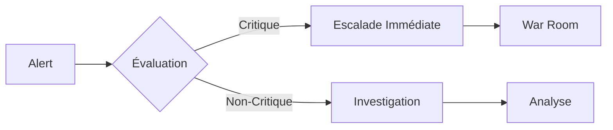

# Politique de Sécurité - AWKWARD LEGACY

## Table des matières

1. [Versions Supportées](#versions-supportées)
2. [Signalement de Vulnérabilités](#signalement-de-vulnérabilités)
3. [Architecture de Sécurité](#architecture-de-sécurité)
4. [Mesures de Sécurité Implémentées](#mesures-de-sécurité-implémentées)
5. [Standards et Conformité](#standards-et-conformité)
6. [Checklist de Sécurité](#checklist-de-sécurité)
7. [Réponse aux Incidents](#réponse-aux-incidents)
8. [Formation et Sensibilisation](#formation-et-sensibilisation)

---

## Versions Supportées

Nous maintenons activement les versions suivantes avec des correctifs de sécurité :

| Version | Supportée          | Fin de Support    | Notes                    |
| ------- | ------------------ | ----------------- | ------------------------ |
| 1.0.x   | :white_check_mark: | 31/12/2026        | Version stable actuelle  |
| 0.9.x   | :warning:          | 31/12/2025        | Support critique only    |
| < 0.9   | :x:                | -                 | Non supporté             |

### Cycle de Mise à Jour

- **Patches de sécurité critiques** : Dans les 24 heures
- **Vulnérabilités hautes** : Dans les 72 heures
- **Vulnérabilités moyennes** : Dans les 7 jours
- **Vulnérabilités faibles** : Prochaine release mineure

---

## Signalement de Vulnérabilités

### 🔴 Processus de Signalement

Si vous découvrez une vulnérabilité de sécurité, merci de suivre notre processus de divulgation responsable :

1. **NE PAS** créer d'issue publique sur GitHub
2. **NE PAS** divulguer publiquement avant correction

### 📧 Contact Sécurité

**Email**: security@awkward-legacy.com
**PGP Key**: [Télécharger la clé publique](https://awkward-legacy.com/security.asc)

```
-----BEGIN PGP PUBLIC KEY BLOCK-----
[Clé PGP à insérer]
-----END PGP PUBLIC KEY BLOCK-----
```

### 📝 Format de Rapport

Merci d'inclure dans votre rapport :

```markdown
**Type de vulnérabilité**: [Ex: XSS, SQLi, CSRF, etc.]
**Sévérité estimée**: [Critique/Haute/Moyenne/Faible]
**Version affectée**: [Ex: 1.0.3]
**Étapes de reproduction**:
1. Aller sur...
2. Cliquer sur...
3. Observer que...
**Impact potentiel**: [Description de l'impact]
**Suggestion de correction**: [Si applicable]
**Proof of Concept**: [Code/screenshot si nécessaire]
```

### ⏱️ Timeline de Réponse

- **Accusé de réception** : < 24 heures
- **Évaluation initiale** : < 72 heures
- **Plan de correction** : < 7 jours
- **Patch disponible** : Variable selon sévérité
- **Divulgation publique** : 90 jours après le patch

### 🎁 Bug Bounty Program

Nous offrons des récompenses pour les vulnérabilités valides :

| Sévérité | Récompense    | Exemples                           |
|----------|---------------|-------------------------------------|
| Critique | $500 - $2000  | RCE, Auth bypass, Data breach      |
| Haute    | $200 - $500   | SQLi, XSS stocké, Privilege escalation |
| Moyenne  | $50 - $200    | CSRF, XSS réfléchi, Info disclosure |
| Faible   | Remerciements | Config issues, Missing headers      |

---

## Architecture de Sécurité

### 🏗️ Défense en Profondeur

```
┌─────────────────────────────────────────────────┐
│                   Internet                      │
└────────────────────┬────────────────────────────┘
                     │
         ┌──────────▼──────────┐
         │    WAF / CDN        │ ← DDoS Protection
         │   (Cloudflare)      │ ← Bot Protection
         └──────────┬──────────┘
                    │
         ┌──────────▼──────────┐
         │   Load Balancer     │ ← SSL/TLS Termination
         │    (Nginx)          │ ← Rate Limiting
         └──────────┬──────────┘
                    │
         ┌──────────▼──────────┐
         │   Application       │ ← Authentication
         │   (Python/OCaml)    │ ← Authorization (RBAC)
         └──────────┬──────────┘
                    │
         ┌──────────▼──────────┐
         │    Database         │ ← Encryption at Rest
         │   (PostgreSQL)      │ ← Access Control
         └─────────────────────┘
```

### 🔐 Zones de Sécurité

1. **DMZ (Zone Démilitarisée)**
   - Nginx reverse proxy
   - Services publics

2. **Zone Application**
   - Serveurs d'application
   - Redis cache
   - Services internes

3. **Zone Données**
   - Base de données
   - Stockage fichiers
   - Backups

---

## Mesures de Sécurité Implémentées

### 1. 🔑 Authentification et Autorisation

#### Authentification Multi-Facteurs
- **Mots de passe**
  - ✅ Hashage : Argon2id (préféré) / Bcrypt / PBKDF2-SHA256
  - ✅ Politique de complexité enforced
  - ✅ Rotation obligatoire tous les 90 jours
  - ✅ Historique des 5 derniers mots de passe

- **Tokens JWT**
  - ✅ Algorithm: HS256 avec secret rotatif
  - ✅ Expiration: 1 heure (configurable)
  - ✅ Refresh tokens avec rotation
  - ✅ Blacklist des tokens révoqués

- **2FA/MFA**
  - ✅ TOTP (Google Authenticator compatible)
  - ✅ SMS backup (optionnel)
  - ✅ Recovery codes

#### Autorisation (RBAC)
```python
Rôles disponibles:
- ADMIN: Accès complet
- USER: Accès aux propres données
- MODERATOR: Gestion contenu
- SUPPORT: Lecture seule
- AUDIT: Logs uniquement
```

### 2. 🔒 Chiffrement

#### Chiffrement au Repos
- **Base de données** : Transparent Data Encryption (TDE)
- **Fichiers** : AES-256-GCM
- **Backups** : AES-256 + compression

#### Chiffrement en Transit
- **TLS 1.3** obligatoire (TLS 1.2 minimum)
- **Ciphers modernes** uniquement
- **HSTS** avec preload
- **Certificate pinning** pour apps mobiles

#### Gestion des Clés
- **KMS** : AWS KMS / HashiCorp Vault
- **Rotation** : Automatique tous les 90 jours
- **HSM** : Pour clés critiques (option enterprise)

### 3. 🛡️ Protection des Données

#### Input Validation
- ✅ Validation côté serveur obligatoire
- ✅ Sanitization de toutes les entrées
- ✅ Parameterized queries (anti-SQLi)
- ✅ Content-Type validation
- ✅ File upload restrictions

#### Output Encoding
- ✅ HTML entity encoding
- ✅ JavaScript encoding
- ✅ URL encoding
- ✅ CSS encoding

#### Protection CSRF
- ✅ Double Submit Cookie
- ✅ Synchronizer Token Pattern
- ✅ SameSite cookies

### 4. 📊 Monitoring et Logging

#### Logs de Sécurité
```json
{
  "timestamp": "2025-10-17T10:30:45Z",
  "event_type": "authentication_failed",
  "user_id": "user123",
  "ip_address": "192.168.1.1",
  "user_agent": "Mozilla/5.0...",
  "details": {
    "attempts": 3,
    "reason": "invalid_password"
  }
}
```

#### Events Loggés
- ✅ Authentifications (succès/échec)
- ✅ Changements de permissions
- ✅ Accès aux données sensibles
- ✅ Modifications de configuration
- ✅ Erreurs de sécurité

#### SIEM Integration
- **Elastic Stack** (ELK)
- **Splunk** (Enterprise)
- **Alerting** : PagerDuty / OpsGenie

### 5. 🚦 Rate Limiting et DDoS Protection

#### Rate Limiting
| Endpoint | Limite | Fenêtre | Action |
|----------|--------|---------|--------|
| /login | 5 req | 15 min | Block IP |
| /api/* | 100 req | 1 min | Throttle |
| /register | 3 req | 1 heure | Captcha |
| /password-reset | 3 req | 1 heure | Email delay |

#### DDoS Protection
- **CloudFlare** : Protection Layer 7
- **Nginx** : Connection limits
- **Fail2ban** : IP blocking
- **SYN cookies** : Kernel level

### 6. 🔍 Vulnerability Management

#### Scanning Automatique
- **Dépendances** : Dependabot, Snyk
- **Containers** : Trivy, Clair
- **Code** : SonarQube, CodeQL
- **Infrastructure** : OpenVAS, Nessus

#### Patch Management
```bash
# Vérification quotidienne
0 2 * * * /usr/local/bin/check-vulnerabilities.sh

# Auto-update pour patches critiques
*/15 * * * * /usr/local/bin/auto-patch-critical.sh
```

---

## Standards et Conformité

### 🏛️ Conformité Réglementaire

- ✅ **RGPD** (EU) - Compliant
- ✅ **CCPA** (California) - Compliant
- ✅ **ISO 27001** - En cours de certification
- ✅ **SOC 2 Type II** - Planifié 2026
- ✅ **PCI DSS** - N/A (pas de paiements)

### 📜 Standards de Sécurité

- **OWASP Top 10** - Tous contrôles implémentés
- **CIS Controls** - Level 1 compliant
- **NIST Cybersecurity Framework** - Adopté
- **SANS Top 25** - Vérifié

### 🎯 Security Headers

```nginx
# Headers de sécurité obligatoires
Strict-Transport-Security: max-age=63072000; includeSubDomains; preload
X-Frame-Options: SAMEORIGIN
X-Content-Type-Options: nosniff
X-XSS-Protection: 1; mode=block
Referrer-Policy: strict-origin-when-cross-origin
Content-Security-Policy: default-src 'self'; script-src 'self' 'unsafe-inline'...
Permissions-Policy: camera=(), microphone=(), geolocation=()
```

---

## Checklist de Sécurité

### 🚀 Pre-Deployment Checklist

#### Application
- [ ] Tous les secrets en variables d'environnement
- [ ] Mode debug désactivé
- [ ] Error handling sans leak d'info
- [ ] Validation input sur tous les endpoints
- [ ] Rate limiting configuré
- [ ] CORS correctement configuré
- [ ] Sessions avec timeout
- [ ] HTTPS only cookies

#### Infrastructure
- [ ] Firewall configuré (ports minimaux)
- [ ] SSH avec clés uniquement
- [ ] Fail2ban installé
- [ ] Mises à jour système appliquées
- [ ] Backups chiffrés et testés
- [ ] Monitoring actif
- [ ] Logs centralisés

#### Database
- [ ] Utilisateur DB avec privilèges minimaux
- [ ] Connexions chiffrées (SSL/TLS)
- [ ] Audit logging activé
- [ ] Backups automatiques
- [ ] Pas de données sensibles en clair

#### CI/CD
- [ ] Secrets management (Vault/AWS Secrets)
- [ ] Security scanning dans pipeline
- [ ] Dependency checking
- [ ] Container scanning
- [ ] Code analysis (SAST)
- [ ] No secrets in Git history

### 🔄 Post-Deployment Checklist

- [ ] SSL Labs test (A+ rating)
- [ ] Security headers test
- [ ] OWASP ZAP scan
- [ ] Nmap port scan
- [ ] Load testing
- [ ] Penetration testing (trimestriel)

---

## Réponse aux Incidents

### 📋 Plan de Réponse

#### 1. Détection


#### 2. Containment
- Isoler les systèmes affectés
- Bloquer les IPs malveillantes
- Révoquer les accès compromis
- Activer le mode maintenance si nécessaire

#### 3. Éradication
- Identifier la cause racine
- Patcher la vulnérabilité
- Nettoyer les systèmes infectés
- Mettre à jour les signatures

#### 4. Recovery
- Restaurer depuis backups clean
- Redémarrer services progressivement
- Monitorer intensivement
- Validation complète

#### 5. Post-Mortem
- Timeline des événements
- Impact assessment
- Lessons learned
- Action items

### 📞 Contacts d'Urgence

| Rôle | Contact | Disponibilité |
|------|---------|---------------|
| Security Lead | security@awkward-legacy.com | 24/7 |
| CTO | cto@awkward-legacy.com | Business hours |
| DPO | dpo@awkward-legacy.com | Business hours |
| Legal | legal@awkward-legacy.com | Business hours |
| PR/Comm | pr@awkward-legacy.com | Business hours |

### 📊 Métriques de Sécurité

**MTTD** (Mean Time To Detect): < 15 minutes
**MTTR** (Mean Time To Respond): < 1 heure
**MTTC** (Mean Time To Contain): < 4 heures
**MTTF** (Mean Time To Fix): < 24 heures

---

## Formation et Sensibilisation

### 👥 Programme de Formation

#### Pour les Développeurs
- **Secure Coding** : Trimestriel
- **OWASP Top 10** : Annuel
- **Security Champions** : Programme continu
- **Threat Modeling** : Par projet

#### Pour tous les Employés
- **Phishing Awareness** : Mensuel
- **Password Security** : Onboarding + annuel
- **Data Handling** : Onboarding + bi-annuel
- **Incident Reporting** : Onboarding

### 📚 Ressources

#### Documentation Interne
- [Security Wiki](https://wiki.awkward-legacy.com/security)
- [Secure Coding Guidelines](https://docs.awkward-legacy.com/security/coding)
- [Incident Response Playbooks](https://docs.awkward-legacy.com/security/ir)

#### Outils
- **Static Analysis**: SonarQube
- **Dynamic Analysis**: OWASP ZAP
- **Dependency Check**: Snyk
- **Secret Scanning**: GitGuardian

#### Références Externes
- [OWASP](https://owasp.org)
- [SANS](https://www.sans.org)
- [CWE](https://cwe.mitre.org)
- [CVE](https://cve.mitre.org)

---

## Engagement et Amélioration Continue

### 🎯 Nos Engagements

1. **Transparence** : Communication ouverte sur les incidents
2. **Responsabilité** : Assumer nos erreurs et les corriger
3. **Amélioration** : Apprentissage continu
4. **Collaboration** : Travailler avec la communauté

### 📈 KPIs de Sécurité

| Métrique | Objectif | Actuel |
|----------|----------|--------|
| Vulnérabilités critiques | 0 | ✅ 0 |
| Temps de patch moyen | < 7 jours | ✅ 3 jours |
| Coverage des tests de sécurité | > 80% | ✅ 85% |
| Incidents de sécurité/mois | < 5 | ✅ 2 |
| Formation sécurité completion | 100% | ✅ 98% |

### 🔄 Cycle d'Amélioration

```
Plan → Do → Check → Act
  ↑                    ↓
  ←────── Improve ←────
```

---

## Historique des Changements

| Version | Date | Changements |
|---------|------|-------------|
| 1.0 | 2025-10-17 | Version initiale |

---

## Signature

**Dernière mise à jour**: 17 Octobre 2025
**Approuvé par**: [CISO - À définir]
**Prochaine révision**: Janvier 2026

---

**Pour toute question de sécurité, contactez**: security@awkward-legacy.com